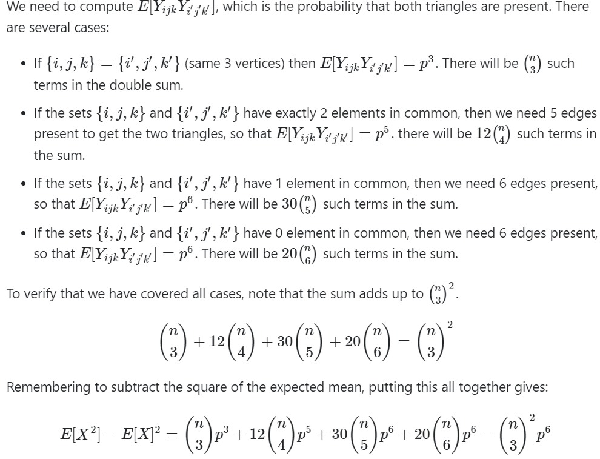

# Random Triangles
## Assignment
In this exercise you are supposed to examine the random variable denoting the number of triangles in a random graph .

For  we let  denote the probability space of graphs on  vertices where each edge is present with probability  independently of other edges. Let   be the random variable denoting the number of triangles in . Compute the expected number of triangles  and its variance .

## Input
The first line of the input file contains a number  of test cases. Each of the  test cases is described as follows.

It starts with a line which consists of an integer  and a real , separated by a space, denoting the number of vertices () and the probability of an edge existing () of a graph.

## Output
For each test case output a single line with two values  and  separated by a space. Your solution is going to be accepted if it has an absolute or relative error of at most .

## Points
This exercise is worth 100 points.

## Explanation of the formulas used

* A _triangle_ is a triple of edges `{u,v}, {v,w}, {w,v}` such that these edges do exist in the graph
Since in our example, each edge exists with probability  independently of others and that there exists `n choose 3` choiches of three edges out of `n` vertices, the formula for  follows automatically.

For the variance, see below:

